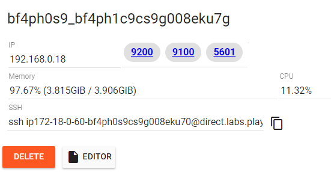
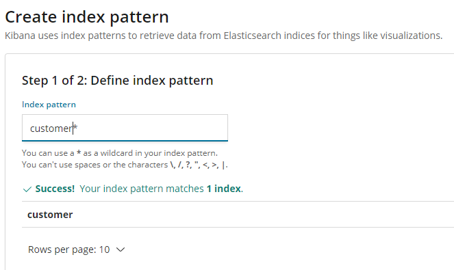
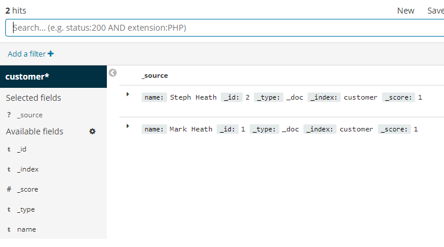
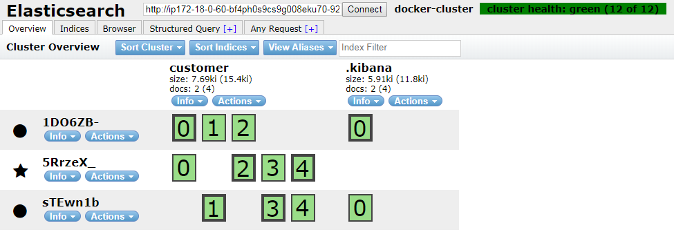

# About
This is repo that i practice from [exploring-elasticsearch-with-docker](https://markheath.net/post/exploring-elasticsearch-with-docker). This repo help u learn how to start and upgrade a new version for elastics.

In this tutorial we saw that not only is it really easy to get an instance of Elasticsearch running with Docker that we could use for experimenting with the API, but with Docker Compose we can define collections of containers that can communicate with one another and start them all easily with docker-compose up.

 
# Content 
- Start a new container running Elasticsearch
- Use Docker Compose to create an Elasticsearch cluster
- Upgrade the cluster to 6.4.2
- Upgrade to a three node cluster
- Add Kibana and head plugin

## Start a new container running Elasticsearch

If you just want to try out Elasticsearch running in a single node, then we can do that with the `docker run` command shown below.
We're exposing ports 9200 (for the REST API), and setting up a single node cluster (using an environment variable), 
from the official [elasticsearch 6.4.2 image](https://www.docker.elastic.co/). I'm also showing how to set up a volume to store the index data in.
```
docker run -d -p 9200:9200 -e "discovery.type=single-node" \
-v esdata:/usr/share/elasticsearch/data \
docker.elastic.co/elasticsearch/elasticsearch:6.4.2
```
And all the Elasticsearch commands we run with `curl` will work just fine on this single container. But for this tutorial, I'm going to use a cluster created with `docker-compose` instead.


## Use Docker Compose to create an Elasticsearch cluster
With `docker-compose` we can declare all the containers that make up an application in a YAML format. For each container we can also configure the environment variables that should be set, any volumes that are required, and define a network to allow the services to communicate with each other.

Here's the first version of our `docker-compose.yml` file. It defines a simple two-node cluster, and each node in the cluster has a volume so that our indexes can live independently of our containers, and survive upgrades (which we'll be doing later). Notice that we're using the version of `elasticsearch` tagged 6.4.1.

```
version: '3'
services:
  elasticsearch:
    image: docker.elastic.co/elasticsearch/elasticsearch:6.4.1
    container_name: elasticsearch
    environment:
      - cluster.name=docker-cluster
      - bootstrap.memory_lock=true
      - "ES_JAVA_OPTS=-Xms512m -Xmx512m"
    ulimits:
      memlock:
        soft: -1
        hard: -1
    volumes:
      - esdata1:/usr/share/elasticsearch/data
    ports:
      - 9200:9200
    networks:
      - esnet
  elasticsearch2:
    image: docker.elastic.co/elasticsearch/elasticsearch:6.4.1
    container_name: elasticsearch2
    environment:
      - cluster.name=docker-cluster
      - bootstrap.memory_lock=true
      - "ES_JAVA_OPTS=-Xms512m -Xmx512m"
      - "discovery.zen.ping.unicast.hosts=elasticsearch"
    ulimits:
      memlock:
        soft: -1
        hard: -1
    volumes:
      - esdata2:/usr/share/elasticsearch/data
    networks:
      - esnet

volumes:
  esdata1:
    driver: local
  esdata2:
    driver: local

networks:
  esnet:
```

To download this file locally as `docker-compose-v1.yml` you can use the following command:
`
curl https://gist.githubusercontent.com/markheath/f246ec3aa5a3e7493991904e241a416a/raw/c4fa64575bc854e34a2506291bd14033caf5e9b6/docker-compose-v1.yml > docker-compose-v1.yml
`


And now we can use the `docker-compose up` command to start up the containers, and create all necessary resources like networks and volumes. We're using `-d` to run in the background just like we can with `docker run`
```
docker-compose -f docker-compose-v1.yml up -d
```

## Check cluster health
We've exposed port 9200 on one of those containers, allowing us to query the cluster health with the following request:
```
curl http://localhost:9200/_cluster/health?pretty
```

#### Create an index
Now let's create an index called *customer*
```
curl -X PUT "localhost:9200/customer?pretty"
```

#### Add a new document
And let's add a document to that index:
```
curl -X PUT "localhost:9200/customer/_doc/1?pretty" \
-H 'Content-Type: application/json' -d'{"name": "Mark Heath" }'
```

#### View documents in the index
There are lots of ways to query elasticsearch indexes and I recommend you check out the [Elasticsearch 6.4 Getting Started Guide](https://www.elastic.co/guide/en/elasticsearch/reference/current/getting-started.html) for more details. However, we can easily retrieve the documents in our existing customer index with:
```
url "localhost:9200/customer/_search?pretty"
```

##Upgrade the cluster to 6.4.2
Suppose we now want to upgrade the nodes in our cluster from Elasticsearch 6.4.2 (we were previously running 6.4.1). What we can do is update our YAML file with new container version numbers.

I have an updated YAML file available here, which you can download to use locally with
```
curl https://gist.githubusercontent.com/markheath/f246ec3aa5a3e7493991904e241a416a/raw/c4fa64575bc854e34a2506291bd14033caf5e9b6/docker-compose-v2.yml > docker-compose-v2.yml
```
Before we upgrade our cluster, take a look at the container ids that are currently running with `docker ps`. These containers are not going to be "upgraded" - they're going to be disposed, and new containers running 6.4.2 will be created. However, the data is safe, because it's stored in the volumes. The volumes won't be deleted, and will be attached to the new containers.

To perform the upgrade we can use the following command.
```
docker-compose -f docker-compose-v2.yml up -d
```

We should see it saying "recreating elasticsearch" and "recreating elasticsearch2" as it discards the old containers and creates new ones.

Now if we run `docker ps` again we'll see new container ids and new image versions.

## Check our index is still present
To ensure that our index is still present we can search again and check our document is still present.
```
curl localhost:9200/customer/_search?pretty
```

Let's add another document into the index with:
```
curl -X PUT "localhost:9200/customer/_doc/2?pretty" -H 'Content-Type: application/json' -d'{"name": "Steph Heath"}'
```

## Upgrade to a three node cluster
OK, let's take this to the next level. I've created a third version of my `docker-compose` YAML file that defines a third container, with its own volume. The YAML file is [available here](https://github.com/Jimmea/docker-elasticsearch-upgrade/blob/master/docker-compose-v3.yml).

Something important to note is that I needed to set the 
`discovery.zen.minimum_master_nodes=2` environment variable to avoid [split brain problems](https://www.elastic.co/guide/en/elasticsearch/reference/2.3/modules-node.html#split-brain)

You can download my example file with:
```
curl https://gist.githubusercontent.com/markheath/f246ec3aa5a3e7493991904e241a416a/raw/a2685d1bf0414acbc684572d00cd7c7c531d0496/docker-compose-v3.yml > docker-compose-v3.yml
```

And then we can upgrade our cluster from two to three nodes with
```
docker-compose -f docker-compose-v3.yml up -d
```

The change of environment variable means that we will recreate both `elasticsearch` and `elasticsearch2`, and of course the new `elasticsearch3` container and its volume will get created.

We should check the cluster status and if all went well, we'll see a cluster size of three:
```
We should check the cluster status and if all went well, we'll see a cluster size of three:
```

Let's check our data is still intact by retrieving a document by id from our index
```
curl -X GET "localhost:9200/customer/_doc/1?pretty"
```

## Add Kibana and head plugin
While I was preparing this tutorial I came across a really nice article by Ruan Bekker who takes this one step further by adding a couple more containers to the docker-compose file for an instance of Kibana and the Elasticsearch Head plugin.

So here's the final `docker-compose.yaml` file we'll be working with:
```
version: '3'
services:
  elasticsearch:
    image: docker.elastic.co/elasticsearch/elasticsearch:6.4.2
    container_name: elasticsearch
    environment:
      - cluster.name=docker-cluster
      - bootstrap.memory_lock=true
      - "ES_JAVA_OPTS=-Xms512m -Xmx512m"
      - http.cors.enabled=true
      - http.cors.allow-origin=*
      - discovery.zen.minimum_master_nodes=2
    ulimits:
      memlock:
        soft: -1
        hard: -1
    volumes:
      - esdata1:/usr/share/elasticsearch/data
    ports:
      - 9200:9200
    networks:
      - esnet

  elasticsearch2:
    image: docker.elastic.co/elasticsearch/elasticsearch:6.4.2
    container_name: elasticsearch2
    environment:
      - cluster.name=docker-cluster
      - bootstrap.memory_lock=true
      - "ES_JAVA_OPTS=-Xms512m -Xmx512m"
      - "discovery.zen.ping.unicast.hosts=elasticsearch"
      - http.cors.enabled=true
      - http.cors.allow-origin=*
      - discovery.zen.minimum_master_nodes=2
    ulimits:
      memlock:
        soft: -1
        hard: -1
    volumes:
      - esdata2:/usr/share/elasticsearch/data
    networks:
      - esnet

  elasticsearch3:
    image: docker.elastic.co/elasticsearch/elasticsearch:6.4.2
    container_name: elasticsearch3
    environment:
      - cluster.name=docker-cluster
      - bootstrap.memory_lock=true
      - "ES_JAVA_OPTS=-Xms512m -Xmx512m"
      - "discovery.zen.ping.unicast.hosts=elasticsearch"
      - http.cors.enabled=true
      - http.cors.allow-origin=*
      - discovery.zen.minimum_master_nodes=2
    ulimits:
      memlock:
        soft: -1
        hard: -1
    volumes:
      - esdata3:/usr/share/elasticsearch/data
    networks:
      - esnet

  kibana:
    image: 'docker.elastic.co/kibana/kibana:6.4.2'
    container_name: kibana
    environment:
      SERVER_NAME: kibana.local
      ELASTICSEARCH_URL: http://elasticsearch:9200
    ports:
      - '5601:5601'
    networks:
      - esnet

  headPlugin:
    image: 'mobz/elasticsearch-head:5'
    container_name: head
    ports:
      - '9100:9100'
    networks:
      - esnet

volumes:
  esdata1:
    driver: local
  esdata2:
    driver: local
  esdata3:
    driver: local

networks:
  esnet:
```

## Try out Kibana
Once we've done this, we can visit the Kibana site by browsing to [localhost:5601](localhost:5601). If you were following along in "Play with Docker" then you'll see special links appear for each port that is exposed (*9200*, *9100* and *5601*).



If you click on the 5601 link, you'll be taken to an instance of Kibana. The first step will be to define an index pattern (e.g. `customers*`)



And then if you visit the discover tab, you'll see we can use Kibana to search the documents in our index:


##Try out Elasticsearch head plugin
You can also visit localhost:9100 (or in Play with Docker, click the 9100 link) to use the Elasticsearch head plugin. This gives you a visualization of the cluster health.


Note that if you are using Play with Docker, you'll need to copy the port 9200 link and paste it into the Connect textbox to connect the head plugin to your Elasticsearch cluster.

##Clean up

To stop and delete all the containers:

```
docker-compose -f docker-compose-v4.yml down
```
And if you want to delete the volumes as well (so all index data will be lost), add the -v flag:

```
docker-compose -f docker-compose-v4.yml down -v
```

## Summary
In this tutorial we saw that not only is it really easy to get an instance of Elasticsearch running with Docker that we could use for experimenting with the API, but with Docker Compose we can define collections of containers that can communicate with one another and start them all easily with `docker-compose up`

When we upgrade our YAML file, Docker Compose can intelligently decide which containers need to be replaced, and which can be left as they are.


